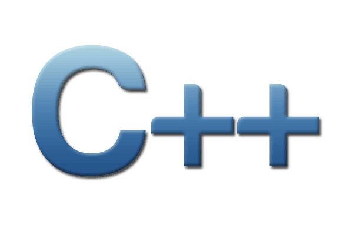
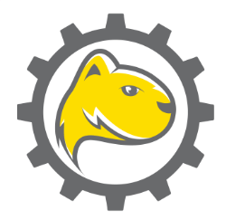
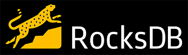

Tecnologías principales
=======================

.. |jsoncpp| image:: images/json.png
   :height: 100px
   :width: 200px
   :scale: 50%
   :alt: alternate text
   :align: middle

.. |cplusplustext| replace:: C++: Lenguaje base.

.. |mongoosetext| replace:: Mongoose como servidor web embebido para gestión de las conexiones web.

.. |rocksdbtext| replace:: RocksDB como base de datos utilizada en el almacenamiento interno.

.. |jsoncpptext| replace:: Formato JSON para transmisión desde y hacia la aplicación utilizando la biblioteca JSONcpp.

.. |curltext| replace:: Conexión con el Shared Server mediante CURL

+-------------+---------------------------+ 
| |cplusplus| | |cplusplustext|           | 
+-------------+---------------------------+ 
| |mongoose|  | |mongoosetext|            | 
+-------------+---------------------------+ 
| |jsoncpp|   | |jsoncpptext|             | 
+-------------+---------------------------+ 
| |rocksdb|   | |rocksdbtext|             | 
+-------------+---------------------------+ 
| |curl|      | |curltext|                | 
+-------------+---------------------------+ 

