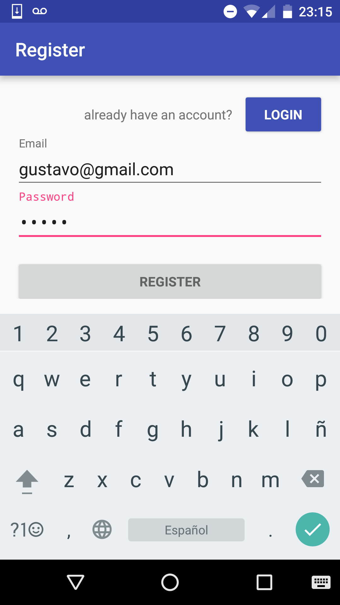
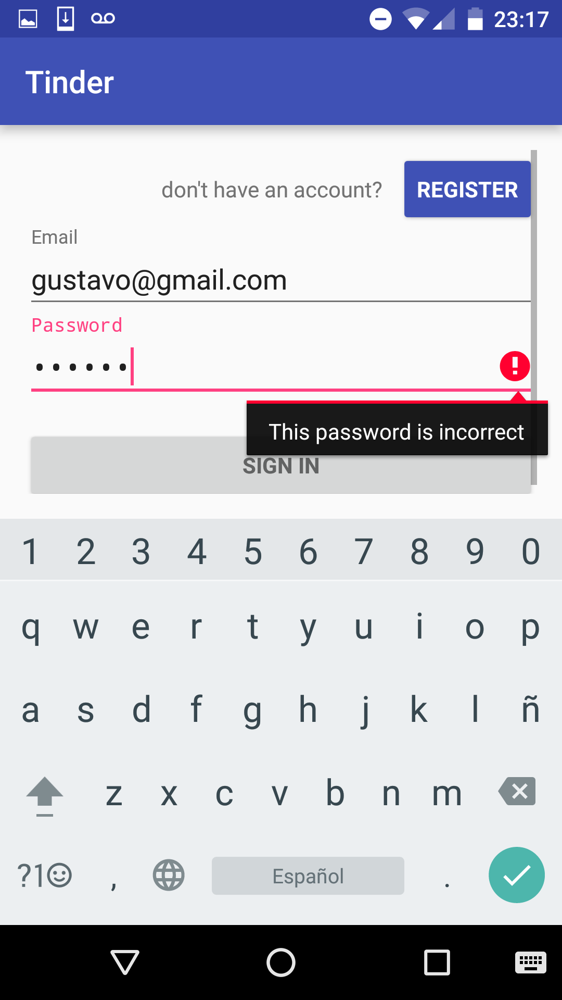
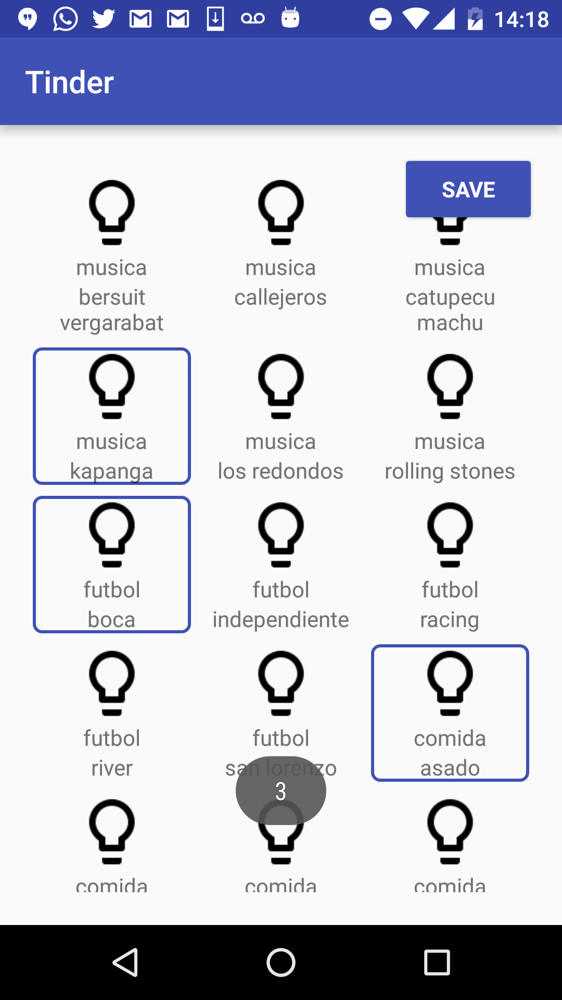
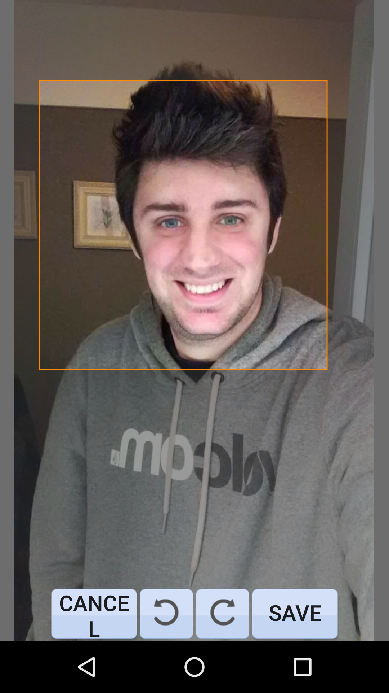
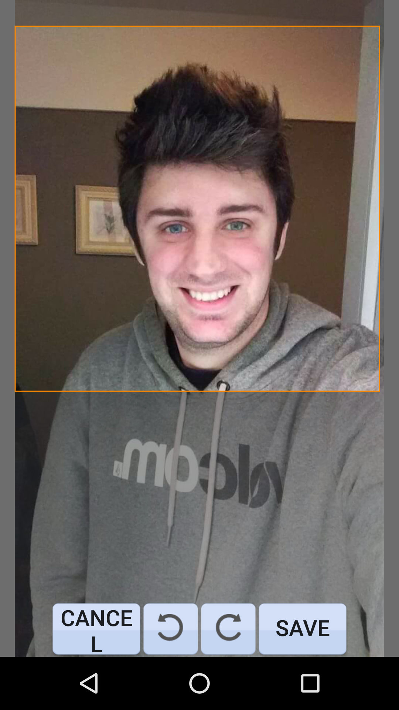
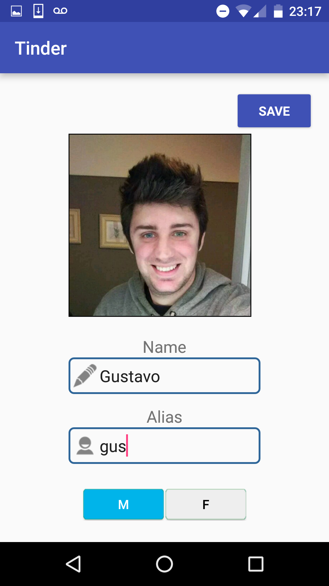

Casos de Uso
============

A continuación se muestran algunos casos de uso con capturas de pantalla.

Primero, nos registramos. Para eso ponemos nuestro email y password deseada. 

El cliente valida que los campos correspondan con el formato que debe tener cada campo. De ser asi, le avisa al servidor este pedido de registro por parte del usuario. 

Si intentamos ingresar con una cuenta invalida, recibimos este mensaje de error en el cliente.

Podemos corregirlo e intentar de nuevo, o registrar una cuenta nueva en la opción “Register”.

Si el usuario no tiene información de perfil, es reenviado a esta ventana, donde debe ingresar su información básica. Incluyendo: foto de perfil, nombre, alias, sexo ,etc.

.. image:: images/casos3.png
   :height: 200px
   :width: 200px
   :scale: 100%
   :alt: Layers
   :align: center

Estos datos son enviados al servidor mediante el UserService cuando se hace click en el boton “Save”.

Luego de esta ventana, se procede a cargar los intereses deseados.

Hemos integrado una librería para realizar el “cropeo” y acomodamiento de la foto de perfil. El usuario puede elegir la escala y rotar la foto. 

+-------------++-------------+-------------+
| |cap1|      | |cap2|       | |cap3|      |
+-------------+--------------+-------------+

Además de esto, se escala la definición de la foto automáticamente, convirtiendo la foto a un determinado tamaño (150 x 150 px). Es algo transparente para el usuario, pero de gran impacto, ya que permite fotos de poco peso que son rápidas para enviar.

