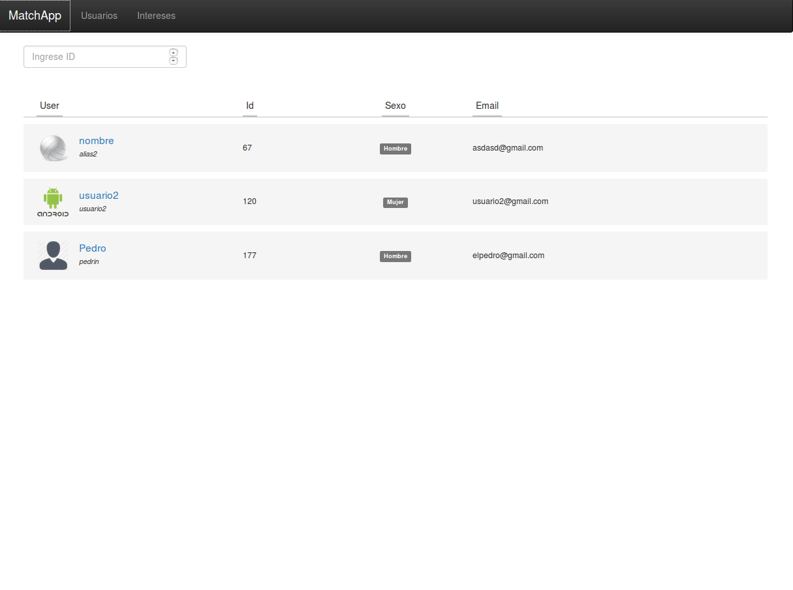
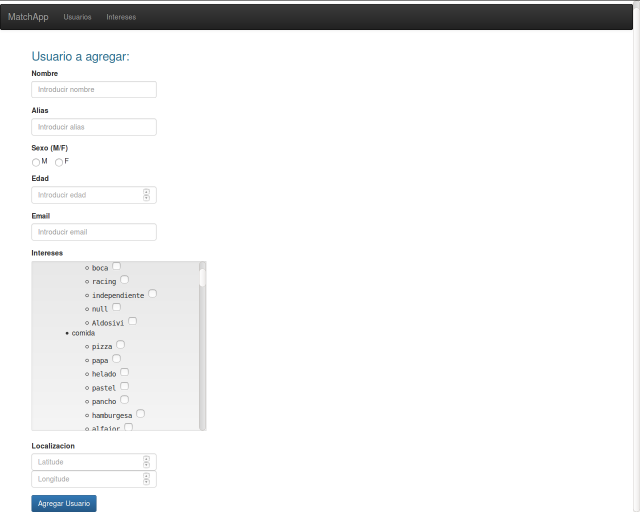
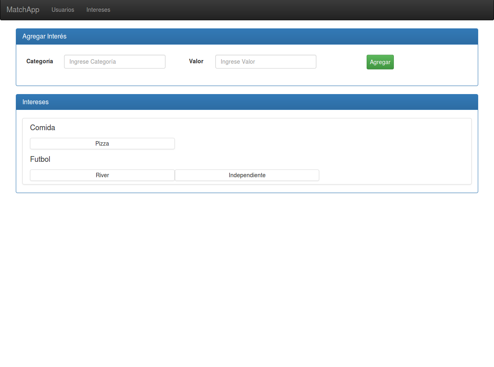

Manual de usuario
===================

Web de administración
---------------------
Para poder administrar los datos almacenados en el servidor se proporciona una página web con las operaciones básicas sobre intereses y usuarios.

URL:  http://tinder-shared.herokuapp.com

Home
~~~~~~~~~~~~~~~~~~~
- URL: http://tinder-shared.herokuapp.com/#/users
- Navegación: “”

   En esta sección es posible listar todos los usuarios y filtrarlos por id.

Creación de usuario
~~~~~~~~~~~~~~~~~~~
- URL: http://tinder-shared.herokuapp.com/#/users/add
- Navegación: “Usuarios/Crear”

   En esta sección es posible crear un usuario completando el formulario y seleccionando los intereses. Al momento de guardar los datos ingresados se podra agregar una foto de perfil que se encuentre almacenada localmente.

Visualización de usuario
~~~~~~~~~~~~~~~~~~~~~~~~~~~~~~~~~~~~~~
- URL: http://tinder-shared.herokuapp.com/#/user/8 (8 es el id del usuario)
- Navegación: Desde el listado de usuarios, clickear en el botón “Ver” de un usuario.

.. figure:: images/usuario_planilla.png
   :align:   center

   Aquí se puede tener una vista más detallada de los usuarios.
   Hacer clic en "1" para modificar la foto de perfil del usuario.
   Hacer clic en "2" para modificar los datos del usuario.
   Hacer clic en "3" para borrar el usuario.

Administrar intereses
~~~~~~~~~~~~~~~~~~~~~~~~~~~~~~~~~~~~~~
- URL: http://tinder-shared.herokuapp.com/#/interests
- Navegación: “Intereses/Administrar”

   Allí podemos ingresar los datos del interés a registrar. Finalmente haciendo clic en el botón “Agregar Interés” se agregara a la base de datos ese interés. Ya sea que la operación haya sido exitosa o no, se informará con un mensaje del estado final.
   Más abajo podemos ver los intereses que actualmente estan registrados en la base de datos.