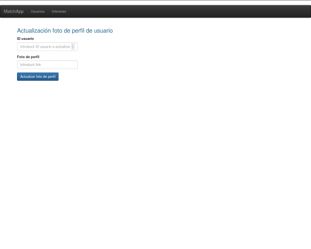
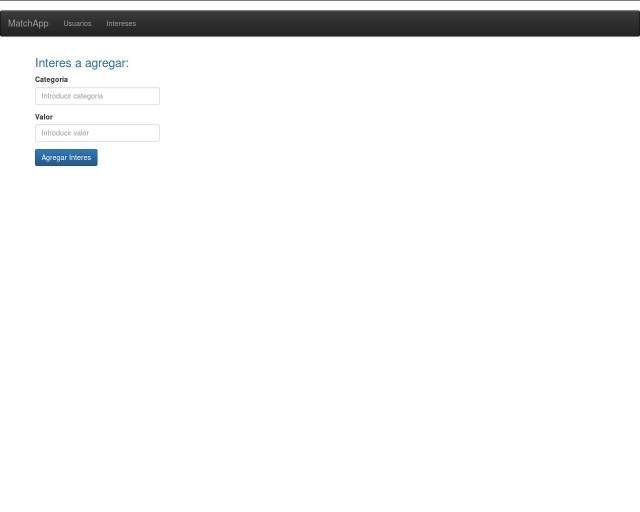

Manual de usuario
===================

Web de administración
---------------------
Para poder administrar los datos almacenados en el servidor se proporciona una página web con las operaciones básicas sobre intereses y usuarios.

URL:  http://tinder-shared.herokuapp.com

Home
~~~~~~~~~~~~~~~~~~~
- URL: http://tinder-shared.herokuapp.com/#/users
- Navegación: “”

.. figure:: images/index.png
   :align:   center

   En esta sección es posible listar todos los usuarios y filtrarlos por id.

Creación de usuario
~~~~~~~~~~~~~~~~~~~
- URL: http://tinder-shared.herokuapp.com/#/users/add
- Navegación: “Usuarios/Crear”

.. figure:: images/usuario_crear.png
   :align:   center

   En esta sección es posible crear un usuario completando el formulario y seleccionando los intereses.

Edición de foto de usuario
~~~~~~~~~~~~~~~~~~~~~~~~~~~~~~~~~~~~~~
- URL: http://tinder-shared.herokuapp.com/#/user/edit/photo
- Navegación: “Usuarios/Editar Foto”

   En esta sección es posible editar la foto de un usuario como una url (actualmente la misma no se encuentra reflejada en el usuario, más adelante funcionará para subir la foto de un usuario, aunque es posible que esto se fusione con la edición de usuario.

Edición de usuario
~~~~~~~~~~~~~~~~~~~
- URL: http://tinder-shared.herokuapp.com/#/users/edit
- Navegación: “Usuarios/Modificar”

.. figure:: images/usuario_modificar.png
   :align:   center

   Allí podemos ingresar el ID del y presionando el botón se cargan los datos del usuario.. Una vez completo el formulario, con el botón “Modificar usuario” se confirman los datos, obteniendo el correspondiente mensaje del estado de la operación.

Visualización de usuario
~~~~~~~~~~~~~~~~~~~~~~~~~~~~~~~~~~~~~~
- URL: http://tinder-shared.herokuapp.com/#/user/8 (8 es el id del usuario)
- Navegación: Desde el listado de usuarios, clickear en el botón “Ver” de un usuario.

.. figure:: images/usuario_planilla.png
   :align:   center

   Aquí se puede tener una vista más detallada de los usuarios.

Creación de intereses
~~~~~~~~~~~~~~~~~~~~~~~~~~~~~~~~~~~~~~
- URL: http://tinder-shared.herokuapp.com/#/interests/add
- Navegación: “Intereses/Crear”

   Allí podemos ingresar los datos del interés a registrar. Finalmente haciendo clic en el botón “Agregar Interés” se agregara a la base de datos ese interés. Ya sea que la operación haya sido exitosa o no, se informará con un mensaje del estado final.

Listar intereses
~~~~~~~~~~~~~~~~~~~
- URL: http://tinder-shared.herokuapp.com/#/interests
- Navegación: “Intereses/Listar”

.. figure:: images/intereses_listar.png
   :align:   center

   En esta sección es posible listar todos los intereses agrupados por categorías.
