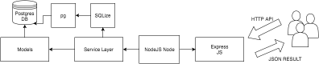
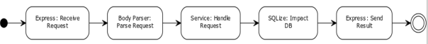

Solución Implementada
======================================

FrontEnd
--------------------------------------------------
#. Dentro de la carpeta “views” se encuentran los .html que contienen toda la estructura de la aplicación web (inputs, formularios, botones, labels, etc). El objetivo de estos archivos es que el usuario pueda ir navegando a través de la página web y realizar las consultas que él considere necesarias y a medida que lo hace pueda hacer cambios sobre la base de datos.
#. Dentro de la carpeta “views” se encuentra el controller.js que es un archivo de JavaScript que contiene la lógica de cómo extraer/agregar/consultar información de los datos y que maneja el flujo e intercambio de estos con la base de datos. También encontramos jquery.js que contiene toda la librería para poder utilizar las funciones que nos provee Jquery.

Backend
---------------------------------------
Estructura general
~~~~~~~~~~~~~~~~~~~
La arquitectura del Shared Server es bastante simple. A continuación se detalla cada componente de la arquitectura y su función.

Express JS
~~~~~~~~~~~~~~~~~~~
Los usuarios se comunican con el servidor usando la API RESTful proporcionada, el ruteador, que utiliza el framework Express JS, se encarga de manejar y derivar la ruta que fue proporcionada. Utilizando Express se facilita el manejo de rutas dado que resulta muy simple e intuitivo.

| 

Service Layer
~~~~~~~~~~~~~~~~~~~
Se creó una capa de servicios la cual es utilizada en los pedidos de la API dependiendo del pedido solicitado. Contiene métodos y validaciones necesarias. Se conecta con la base de datos utilizando un conector.
Existen 2 servicios principales:

- User Service: se encarga de los pedidos relacionados con usuarios. (crear, borrar, consultar, editar)
- Interest Service: se encarga de los intereses. (crear, consultar)

| 

Models
~~~~~~~~~~~~~~~~~~~
Se utilizan modelos simples para representar las entidades y tablas de la base SQL. La comunicación con la base de datos se hace mediante un conector (SQLize) el cual se conecta e interactúa con la base de datos utilizando el módulo ‘pg’.
Una vez que se procesa el pedido se devuelve en formato json siguiendo la API Restful especificada.

| 

Workflow
~~~~~~~~~~~~~~~~~~~

Utilizando el ruteador de Express JS, se accede a la ruta (pedido http) solicitada. En esa ruta se parsean los datos enviados y se los delega al Service indicado (userService o interestService).

El Service, se encarga de procesar los datos que han sido enviados y de hacer los llamados correspondientes al conector de la base de datos.

Una vez que los datos han sido impactados/obtenidos (crear, modificar, borrar, consultar), se devuelve al usuario el resultado correspondiente.
El resultado puede ser el esperado, como también puede ser un código de error, si se produce alguna eventualidad en el proceso.
